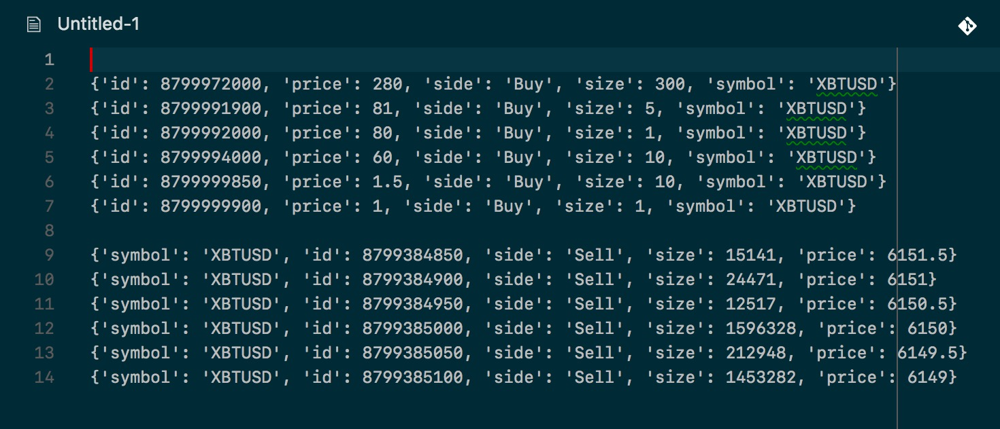

# order_imbalance

## Project Overview

The aim of this project is to study the effect of order imbalance on the price of Bitcoin.

## Files

1. data_collect.py

This notebook reads 55 dump files of format xbtusd.dump*, applies some data cleaning process and then exports it to a single CSV with required data.

Data is exported to first_sum_55h.csv.

1. order_imbalance.py

This file logs the incoming data to two files:

* one file contains orderbook and trade data as received from websocket(without parsing)

* another file contains prices and sizes for top 10 orders in the order book for both sides

2. data_analysis.ipynb

Reads df_join.csv at the start of the notebook. Studying simple correlation between price change and input features.

3. order_imbalance.ipynb

This notebook shows that features we selected were highly skewed. So, we could not make any statistical conclusion from it.

## Output

The `id` and `price` have same relation for both side of `orderBookL2`:
when `id` increases, `price` decreases:

Here is sample data from **orderBook.dump** when `action = partial` showing the inverse relation between `price` and `id` for both side of orderbook:

